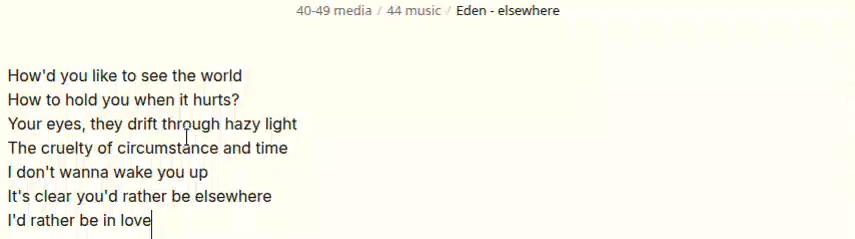
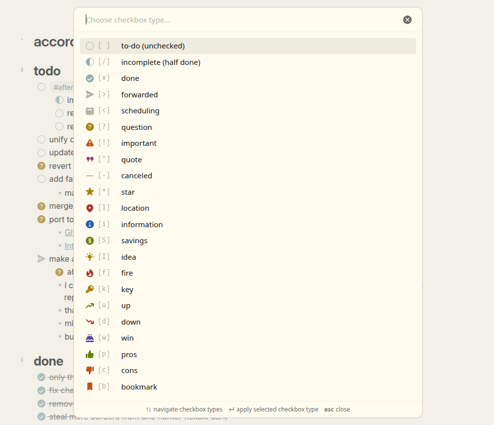

# MEH: More Excellent Hotkeys
  
small obsidian plugin for quick markdown formatting toggles.  

  
- the main feature is that it selects up to the nearest word:  
  - selecting something like: `hello th[is is some sent]ence` and hitting `Toggle bold` (from this plugin) will result in `hello **this is some sentence**`
  - similarly, `hello **thi[s is some sen]tence**` -> `Toggle bold` -> `hello this is some sentence`.
- cursor position is preserved where reasonable.

## local installation  
you can probably use BRAT (i haven't tested it).  
  
---
download `meh-more-excellent-hotkeys.zip` from the latest release.  
unzip it, such that its contents are in `<your vaullt>/.obsidian/plugins/meh-more-excellent-hotkeys`,  
e.g. `<your vaullt>/.obsidian/plugins/meh-more-excellent-hotkeys/main.js`  

## commands added
this plugin adds editor commands you can bind to your own hotkeys (no default bindings).  
- Toggle bold
- Toggle highlight
- Toggle italics
- Toggle inline code
- Toggle comment
- Toggle strikethrough
- Toggle underscore
- Remove formatting
- Change checkbox type (opens fuzzy picker)

## settings
- Use `*` for italics (default: off, `_` is used)

## checkbox picker

_To get the same icons as I have in the screenshot, see [my snippets repo](https://gitlab.com/minecraftpiston/obsidian-snippets)._
  
- Works on task lines like `- [ ] item`
- Supports Obsidian extended checkbox markers (hardcoded for now)
- Opens as a fuzzy picker modal
- Also available from the editor right-click menu when cursor is on a checkbox line

## other
- thanks to Cawlin for the name
- thanks to [obsidian-smarter-md-hotkeys](https://github.com/chrisgrieser/obsidian-smarter-md-hotkeys) for the idea and some code
- increase/decrease heading level commands were removed (out of scope) - use [obsidian-heading-shifter](https://github.com/k4a-l/obsidian-heading-shifter)

## support development
 

You can support ongoing development & maintainance by donating. All donations are highly appreciated! <3
